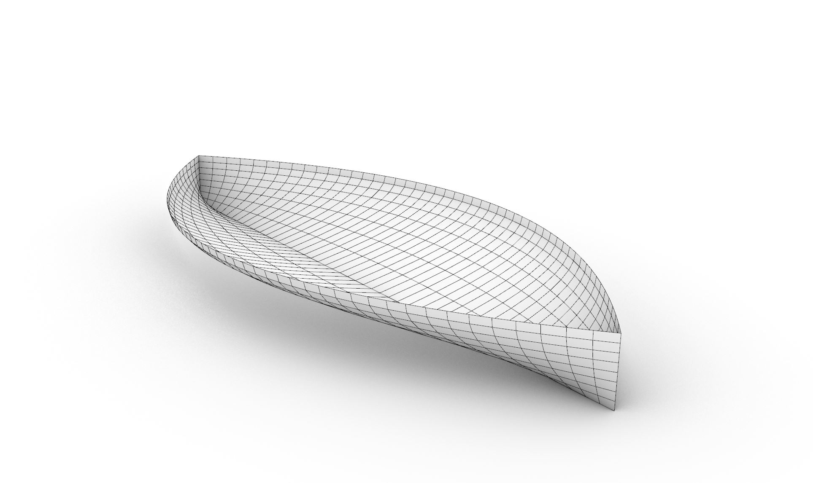

# boatHull
A simple visualization of a wigley boat hull in Rhino3D

## Equation

## Images

## Refererences
- [Image source](https://www.chegg.com/homework-help/questions-and-answers/wigley-hull-design-2-geometry-ship-hull-wigley-hull-modeled-equation-width-1-vergen-1-heig-q63467000)
- [Rhino3D Forum discussion](https://discourse.mcneel.com/t/learning-expressions/84610)
